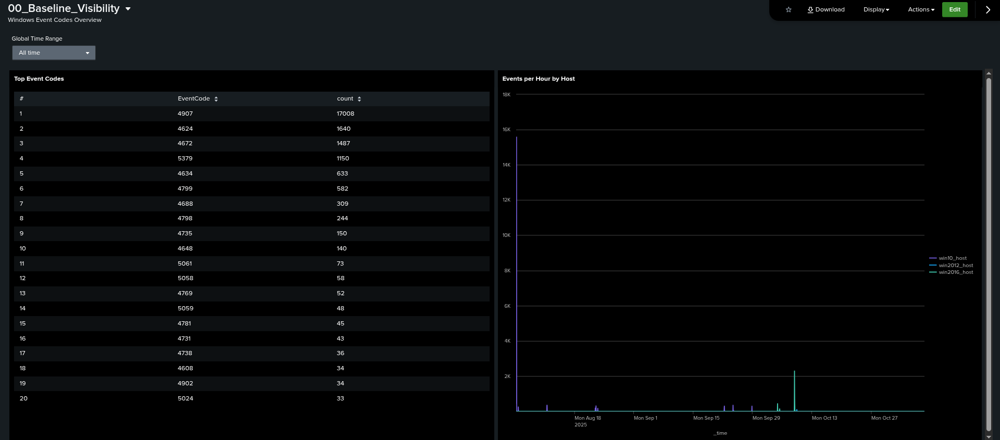
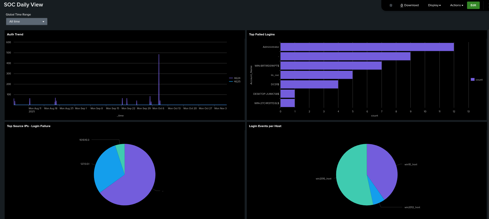

# SOC Analyst Practice - Windows Security Logs

## Work Summary

### Windows Event Logs
- Collected logs from three Windows hosts: win10_host, win2012_host, win2016_host.
- Analyzed top Event Codes and created a CSV with their meanings.

### Dashboards
1. **00_Baseline_Visibility**
   - Panel 1: Top Event Codes
   - Panel 2: Events Per Hour by Host
     
     


2. **SOC_Daily_View**
   - Panel 1: Auth Trend (4624/4625)
   - Panel 2: Top Failed Accounts
   - Panel 3: Top Source IPs
   - Panel 4: Total Events per Host
     
     


### Queries Used
- List all indexes:
  ```spl
  | eventcount summarize=false index=* | sort - count
  ```
- List All Event Codes:
  ```spl
  index IN (win10_host, win2012_host, win2016_host) sourcetype="WinEventLog:Security"
  | stats count by EventCode
  | sort - count
  ```
- Identify Fields for Event ID 4625
  ```spl
  index IN (win10_host, win2012_host, win2016_host) EventCode=4625 | head 20
  ```
- List Failed Logins by Account
  ```
  index IN (win10_host, win2012_host, win2016_host) EventCode=4625
  | stats count by Account_Name
  | sort - count
  ```
- List Top Source IPs (Failed Logins)
  ```
  index IN (win10_host, win2012_host, win2016_host) EventCode=4625
  | stats count by Source_Network_Address
  | sort - count
  ```
- List Events by Time Windows
  ```
  index IN (win10_host, win2012_host, win2016_host) earliest=-15m
  index IN (win10_host, win2012_host, win2016_host) earliest=-24h@h latest=now
  index IN (win10_host, win2012_host, win2016_host) earliest=-7d@d latest=@d
  ```
- List Login Events per Host
  ```
  index IN (win10_host, win2012_host, win2016_host) (EventCode=4624 OR EventCode=4625)
  | stats count by index
