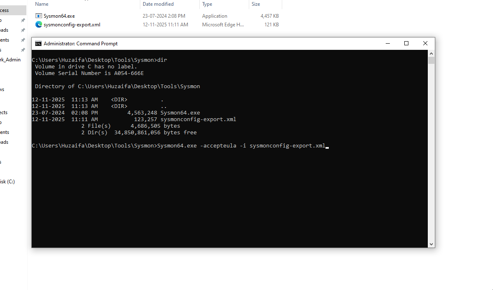

# SOC Analyst Practice - Splunk & Sysmon Hands-on

## Work Summary

- Installed **Sysmon** on one host (`win10_host`) using the [SwiftOnSecurity Sysmon config](https://github.com/SwiftOnSecurity/sysmon-config).
  
  
- Installed Splunk Add-ons:
  - [Splunk Add-on for Microsoft Windows](https://splunkbase.splunk.com/app/742)
  - [Splunk Add-on for Sysmon](https://splunkbase.splunk.com/app/3001)
  - [Splunk Security Essentials](https://splunkbase.splunk.com/app/3435)

### Baseline Running Processes (Sysmon)

This query lists the currently running processes on Windows hosts using Sysmon, showing process names, command lines, and parent processes for monitoring and investigation.

```
index=win10_host sourcetype=XmlWinEventLog:Microsoft-Windows-Sysmon/Operational
| stats count by Image, CommandLine, ParentImage
| sort - count
```

## Queries and Detections

The following queries and detections were created to monitor and analyze critical security events on Windows hosts.

### 1. Brute-force / Credential Stuffing

This query searches for failed login attempts (EventCode=4625) on Windows hosts, grouping them into 5-minute intervals. It counts the number of failed attempts per account and the distinct source IPs, and only shows accounts with five or more failures in that interval. This helps detect high-frequency failed login activity, which may indicate brute-force or credential stuffing attempts.

```
index=win10_host EventCode=4625
| bin _time span=5m
| stats dc(Source_Network_Address) as src_count, count as fails by Account_Name, _time
| where fails >= 5
```

### 2. Successful Login After Multiple Failures

This query looks at both failed (4625) and successful (4624) logins. For each account, it counts the number of failed attempts that occurred immediately before a successful login and filters for cases where there were three or more failures. This identifies accounts that successfully log in after multiple failed attempts, potentially signaling compromised credentials.

```
index=win10_host (EventCode=4625 OR EventCode=4624)
| sort 0 _time
| streamstats window=6 current=f count(eval(EventCode==4625)) as recent_failures by Account_Name
| where EventCode==4624 AND recent_failures>=3
```

### 3. New Local User Creation

This query detects EventCode 4720, showing newly created user accounts, the creator, the time, and the host. It helps identify unauthorized account creation or potential privilege escalation.

```
index=win10_host (EventCode=4625 OR EventCode=4624)
| sort 0 _time
| streamstats window=6 current=f count(eval(EventCode==4625)) as recent_failures by Account_Name
| where EventCode==4624 AND recent_failures>=3
```

### 4. Sensitive Command Execution (PowerShell, Certutil)

This query searches for executions of commands containing powershell or certutil across Windows hosts. It groups results by computer, user, and full command line, helping identify potentially dangerous or unauthorized command execution for further investigation.

```
index=win10_host (CommandLine="*powershell*" OR CommandLine="*certutil*")
| stats count by Computer, User, CommandLine
```

### 5. Log Clear / Audit Policy Changes

This query monitors EventCodes 1102 (audit log cleared) and 4719 (audit policy changes). It counts these events by time, computer, and account, and only shows occurrences with at least one event. This helps detect tampering with audit logs or changes to audit policies, which may indicate malicious activity or attempts to cover tracks.

```
index=win10_host EventCode=1102 OR EventCode=4719
| stats count by _time, ComputerName, Account_Name, EventCode
| where count >= 1
```
